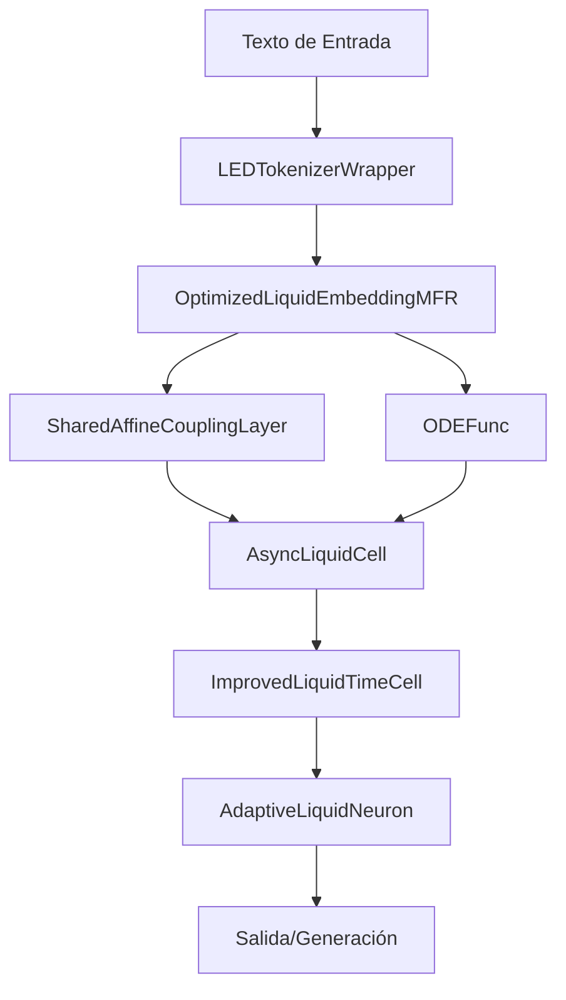

# Modelo de Generación de Texto con Procesamiento de Secuencias Largas

## ⚠️ AVISO IMPORTANTE

**PROYECTO EN FASE EXPERIMENTAL**

Este modelo se encuentra actualmente en fase de pruebas y desarrollo. El código proporcionado es una implementación conceptual que:

- Está siendo evaluado en entornos de prueba controlados
- No generará resultados coherentes en su estado actual
- No debe utilizarse en entornos de producción
- Sirve como base para investigación y experimentación

El objetivo de este repositorio es compartir la arquitectura y conceptos del modelo para fines educativos y de investigación. Si desea una solución probada para procesamiento de texto, considere utilizar modelos establecidos como GPT, BERT o T5.

---

## 🏗️ Arquitectura del Modelo

### Visión General de las Clases

El modelo está compuesto por varias clases especializadas que trabajan en conjunto. Aquí está la explicación detallada de cada una:

### 1. LEDTokenizerWrapper
```python
class LEDTokenizerWrapper:
    def __init__(self, pretrained_model_name='allenai/led-base-16384')
```
**Función Individual:**
- Encapsula el tokenizador LED para procesar texto
- Maneja la conversión de texto a tokens y viceversa
- Gestiona padding y truncamiento

**Rol en el Modelo:**
- Entrada inicial del pipeline de procesamiento
- Preprocesamiento de texto para el modelo
- Postprocesamiento para la generación final

### 2. SharedAffineCouplingLayer
```python
class SharedAffineCouplingLayer(nn.Module):
    def __init__(self, input_dim, hidden_dim, shared_nets=None)
```
**Función Individual:**
- Implementa transformaciones invertibles
- Permite reducción dimensional preservando información
- Maneja redes neuronales compartidas para escalado y traslación

**Rol en el Modelo:**
- Componente clave en la reducción dimensional de embeddings
- Parte del pipeline de normalizing flows
- Permite transformaciones reversibles de features

### 3. OptimizedFlowDimensionalityReduction
```python
class OptimizedFlowDimensionalityReduction(nn.Module):
    def __init__(self, original_dim, latent_dim, hidden_dim=128, num_flows=4)
```
**Función Individual:**
- Reduce dimensionalidad de forma invertible
- Implementa múltiples capas de flujo
- Mantiene información semántica importante

**Rol en el Modelo:**
- Procesa embeddings iniciales
- Reduce dimensionalidad manteniendo información clave
- Prepara datos para el procesamiento temporal

### 4. ODEFunc
```python
class ODEFunc(nn.Module):
    def __init__(self, layer_norm, decay_factor=0.1, adaptive_factor=0.01)
```
**Función Individual:**
- Define la dinámica temporal continua
- Implementa transformaciones no lineales
- Maneja factores de decaimiento y adaptación

**Rol en el Modelo:**
- Núcleo del procesamiento temporal continuo
- Evolución de estados latentes
- Control de la dinámica del sistema

### 5. LiquidNeuron y AdaptiveLiquidNeuron
```python
class LiquidNeuron(nn.Module):
    def __init__(self, hidden_size)

class AdaptiveLiquidNeuron(nn.Module):
    def __init__(self, hidden_size, dropout_rate=0.1)
```
**Función Individual:**
- LiquidNeuron: Implementa neurona base con dinámica temporal
- AdaptiveLiquidNeuron: Añade adaptabilidad y dropout

**Rol en el Modelo:**
- Procesamiento neuronal adaptativo
- Manejo de dependencias temporales
- Control de flujo de información

### 6. ImprovedLiquidTimeCell
```python
class ImprovedLiquidTimeCell(nn.Module):
    def __init__(self, hidden_size, dropout_rate=0.1)
```
**Función Individual:**
- Célula temporal mejorada
- Integración de ODEs
- Control de estabilidad

**Rol en el Modelo:**
- Procesamiento temporal principal
- Integración de estados
- Manejo de secuencias temporales

### 7. AsyncLiquidCell
```python
class AsyncLiquidCell(nn.Module):
    def __init__(self, hidden_size, dropout_rate=0.1)
```
**Función Individual:**
- Procesa información de forma asíncrona
- Implementa mecanismos de atención
- Maneja estados ocultos

**Rol en el Modelo:**
- Procesamiento asíncrono de secuencias
- Atención temporal
- Integración de información contextual

### 8. OptimizedLiquidEmbeddingMFR
```python
class OptimizedLiquidEmbeddingMFR(nn.Module):
    def __init__(self, vocab_size, embedding_dim, latent_dim, hidden_size)
```
**Función Individual:**
- Maneja embeddings con flows
- Combina reducción dimensional con procesamiento temporal
- Optimiza representaciones

**Rol en el Modelo:**
- Capa de embedding principal
- Integración de flows y procesamiento temporal
- Preparación de representaciones para el modelo

### 9. LiquidTextGenerationModel
```python
class LiquidTextGenerationModel(nn.Module):
    def __init__(self, vocab_size, embedding_dim, latent_dim, hidden_size)
```
**Función Individual:**
- Modelo completo de generación
- Integra todos los componentes
- Maneja el proceso de generación

**Rol en el Sistema:**
- Punto de entrada principal
- Coordina todos los componentes
- Maneja el proceso completo de generación

## 🔄 Flujo de Datos en el Modelo

1. **Entrada de Texto**
   ```python
   # El texto se procesa primero por el tokenizador
   input_ids, attention_mask = tokenizer.tokenize(text)
   ```

2. **Procesamiento de Embeddings**
   ```python
   # Los tokens pasan por el sistema de embedding
   embeddings, log_det = liquid_embedding(input_ids, attention_mask, t_span)
   ```

3. **Procesamiento Temporal**
   ```python
   # Los embeddings se procesan temporalmente
   h, attn_weights = liquid_cell(embeddings, timestamps, h)
   ```

4. **Generación**
   ```python
   # Finalmente se generan las predicciones
   logits = output_proj(h)
   ```

## 🛠️ Ejemplo de Uso Integrado

```python
# Inicialización del modelo completo
model = LiquidTextGenerationModel(
    vocab_size=32000,
    embedding_dim=512,
    latent_dim=128,
    hidden_size=256
)

# Procesamiento de texto
tokenizer = LEDTokenizerWrapper()
input_ids, attention_mask = tokenizer.tokenize("Texto de ejemplo")

# Generación
output = model(
    input_ids,
    attention_mask,
    torch.linspace(0, 1, steps=5),
    generate_timestamps(batch_size, seq_length)
)
```

## 📊 Interacción entre Componentes



## ⚙️ Configuración Recomendada

```python
# Configuración base recomendada
config = {
    'vocab_size': 32000,
    'embedding_dim': 512,
    'latent_dim': 128,
    'hidden_size': 256,
    'hidden_dim': 128,
    'num_flows': 4,
    'dropout_rate': 0.1
}
```

## 🔍 Notas de Implementación

- Cada componente puede funcionar de forma independiente
- Los componentes están diseñados para ser modulares
- La integración se realiza a través de interfaces bien definidas
- El sistema es extensible para nuevas funcionalidades
